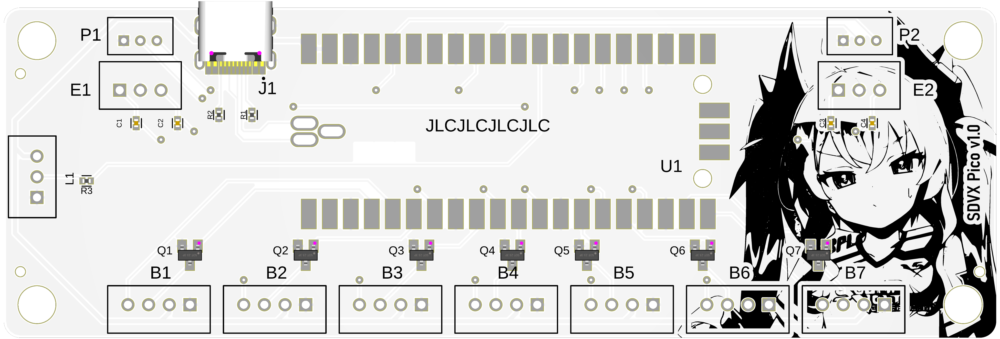

# SVRE 9 Pico PCB
 A Raspberry Pi Pico based drop-in replacement control board for DJDAO's SVRE 9 controller using SpeedyPotato's firmware. [Img Source](https://twitter.com/wagashi928/status/1639880319057952768) (by 和菓子 / Wagashi
@wagashi928)
 
